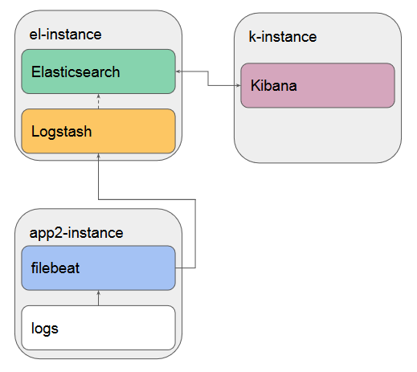

# netology-84

## Что делает playbook

Плейбук развернёт четыре приложения:

- Elasticsearch
- Logstash
- Kibana
- Filebeat

Схема свяхи между приложениями:



## Какие у него есть теги

- elastic
- kibana
- filebeat
- logstash

## Какие у него есть параметры

### Elasticsearch

* Параметр, который определяет какой версии elasticsearch будет установлен
    ```yml
    elasticsearch_version: "7.14.0" 	
    ```

### Logstash

* Версия Logstash
  ```yml
  logstash_version: "7.14.0"
  ```
* URL (выключая порт) для отправки данных в Elasticsearch.
  ```yml
  logstash_elasticsearch_url: "http://localhost:9200"
  ```
* Ограничения памяти JVM. Если памяти мало, поможет избежать oom killer.
  ```yml
  logstash_jvm_initial: "256m"
  logstash_jvm_maximum: "256m"
  ```

### Kibana

* Версия Kibana.
  ```yml
  kibana_version: "7.14.0"
  ```
* URL (выключая порт) по которому Kibana будет соединяться с Elasticsearch.
  ```yml
  kibana_elasticsearch_url: "http://localhost:9200"
  ```

### Filebeat

* Версия Filebeat.
  ```yml
  filebeat_version: "7.14.0"
  ```
* Флаг определяет, куда слать данные.
  ```yml
  filebeat_output_destination: "elastic"
  ```
  Возможные варианты:
    - `elastic` (по-умолчанию)
    - `logstash`

* URL (выключая порт) для отправки данных в Elasticsearch.
  ```yml
  filebeat_elasticsearch_url: "http://localhost:9200"
  ```
* URL (выключая порт) для настройки дешбордов в Kibana.
  ```yml
  filebeat_kibana_url:  "http://localhost:5601"
  ```
* Флаг определяет, нужно ли настрпаивать дешборды Kibana.

  Можно использовать только если данные отправляются в `elastic`!
  ```yml
  filebeat_setup_kibana: true
  ```
* Хост и порт Logstash
  ```yml
  filebeat_logstash_url: "localhost:5044"
  ```

## Как запустить

1. Задайте IP хостов в [hosts.yml](inventory/prod/hosts.yml)
1. Можно настроить переменные в [all.yml](inventory/prod/group_vars/all.yml), если набор хостов изменится или чтобы задать объём памяти JVM.
1. Запустите плейбук
    ```bash
    ansible-inventory -i inventory/prod playbook.yml
    ```